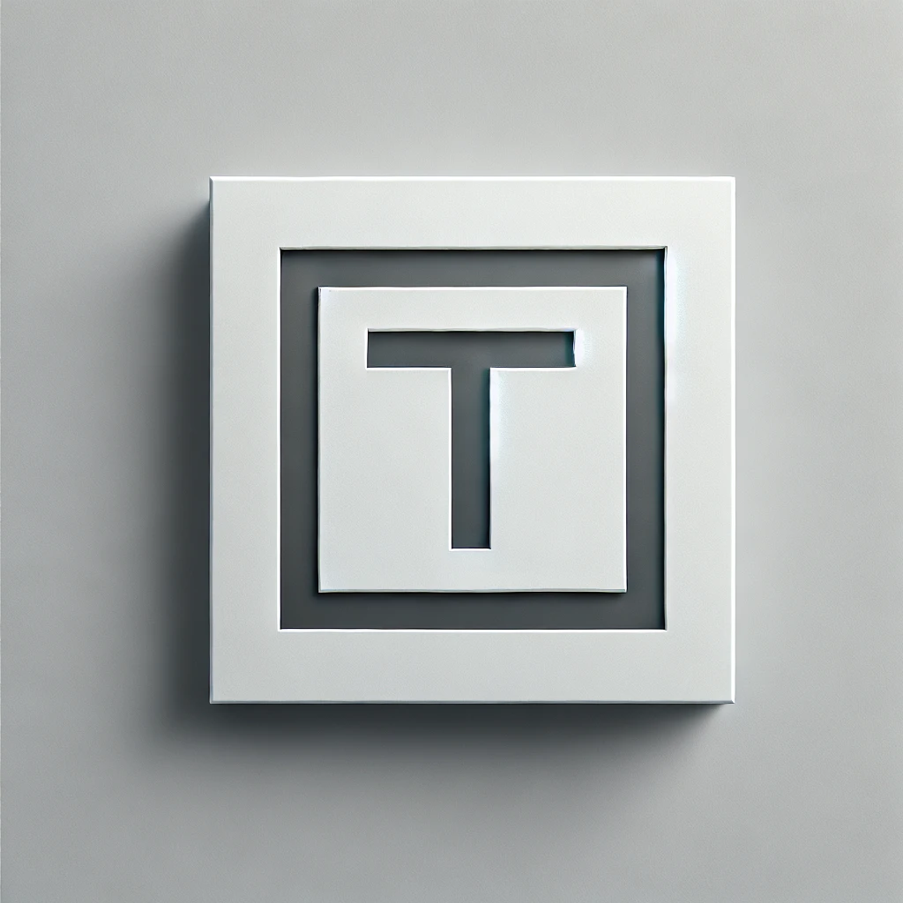

<p align="left">

<h1>Hugo-theme-tiles</h1>
</p>
<br/>
<p align="left">
<a href="https://www.morick66.com/"></a>
<a href="https://github.com/CaiJimmy/hugo-theme-stack"></a>
</p>

<p align="left">
中文/<a href="readme/readme_en.md">English</a>
</p>

##  1. <a name=''></a>目录

* 1. [目录](#)
* 2. [演示](#-1)
	* 2.1. [示例网站——Tiles demo](#Tilesdemohttps:tiles.morick66.com)
* 3. [特性](#-1)
* 4. [安装&使用](#-1)
	* 4.1. [前提条件](#-1)
	* 4.2. [安装主题](#-1)
	* 4.3. [配置](#-1)
* 5. [内容管理](#-1)
	* 5.1. [页面](#-1)
	* 5.2. [文章Frontmatter](#Frontmatter)
	* 5.3. [分类](#-1)
	* 5.4. [图片](#-1)
* 6. [短代码](#-1)
* 7. [支持的服务](#-1)
	* 7.1. [基本服务](#-1)
	* 7.2. [Pieces](#Pieceshttps:github.comMorick66Pieces)
* 8. [致谢](#-1)
	* 8.1. [使用的项目](#-1)
	* 8.2. [参考的博客网站](#-1)
* 9. [许可证](#-1)

##  2. <a name='-1'></a>演示

###  2.1. <a name='Tilesdemohttps:tiles.morick66.com'></a>示例网站——[Tiles demo](https://tiles.morick66.com/)

##  3. <a name='-1'></a>特性

- 明暗主题
- 侧边栏
- 搜索
- 目录
- 基于[Lightbox2](https://github.com/lokesh/lightbox2)的响应式图片查看
- 展示随机文章的小部件

##  4. <a name='-1'></a>安装&使用

###  4.1. <a name='-1'></a>前提条件

  - 主题需要安装Hugo的扩展版本

###  4.2. <a name='-1'></a>安装主题

**git clone**

```bash
git clone git@github.com:Morick66/hugo-theme-tiles.git themes/hugo-theme-tiles
```

**Git submodule**

```bash
git submodule add git@github.com:Morick66/hugo-theme-tiles.git themes/hugo-theme-tiles
```

###  4.3. <a name='-1'></a>配置

**基本配置**

1. 复制exampleSite中的`config.toml`文件到根目录，并自定义修改配置。
2. 复制exampleSite中的`content`文件夹到根目录，并自定义修改内容。

##  5. <a name='-1'></a>内容管理

###  5.1. <a name='-1'></a>页面

页面添加，请在`content/page`目录下创建页面并创建`_index.md`文件。

**页面Frontmatter示例:**

```yaml
---
title: 即刻
description: 片段
color: "#E4AE3A"
layout: pieces
slug: pieces
menu:
  main:
    weight: -90
    params:
      icon: pieces
---
```
**解释:**

- `title`：页面标题。
- `description`：页面描述。
- `color`：页面主题色。
- `layout`：页面布局HTML模板，存放于`layouts/_default`目录下。
- `slug`：页面路径。
- `menu`
  - `main`:
    - `weight`：菜单项的权重，用于排序。
    - `params`:
      - `icon`：菜单项图标。

###  5.2. <a name='Frontmatter'></a>文章Frontmatter

在`content/post`目录下创建文章文件夹，并创建`index.md`文件。

**文章Frontmatter示例:**

```yaml
---
title: Hello World！
description: Hello World！
color: "#6D4B42"
featured: 
keywords: 
date: 2024-03-19
slug: "202403201844"
image: cover.jpg
coverURL: https://images/path/url
canonicalURL: 
categories: 
math: false
tags:
---
```
**解释:**

- `title`：文章标题。
- `description`：文章描述。
- `color`：文章主题色。
- `featured`：是否设置为精选，可设置为`1`或`2`，即主页精选文章第一篇与第二篇，所有文章只可以出现一个`1`和`2`。
- `keywords`：文章关键词。
- `date`：文章发布时间。
- `slug`：文章路径。
- `image`：文章封面图。
- `coverURL`：文章封面图来源链接。
- `canonicalURL`：原文地址。
- `categories`：文章分类。
- `math`：是否启用数学公式。
- `tags`：文章标签。

###  5.3. <a name='-1'></a>分类
创建分类需要在`content/categories`目录下创建分类文件夹，并创建`_index.md`文件。
**分类Frontmatter示例:**
```yaml
---
title: 经验分享
description: 我的知识与经验分享，希望对你有帮助。
slug: experience
keywords:
  - 经验
  - 分享
  - 博客
---
```
**解释:**

- `title`：分类标题。
- `description`：分类描述。
- `slug`：分类路径。
- `keywords`：分类关键词。

###  5.4. <a name='-1'></a>图片

- 图片可全部保存在`static/images`目录下。文章中使用`[image](images/imageName.jpg)`格式进行引用。（markdown编辑器中难以预览）
- 可与文章`index.md`保存在同一级目录，使用`[image](imageName.jpg)`进行引用。（markdown编辑器中方便预览）
- 使用图床服务

##  6. <a name='-1'></a>短代码

具体样式参考：[Demo网站](https://tiles.morick66.com/p/20240321055915/)

**网易云音乐**

```

```

**Spotify**

```

```

**居中引用**

```

居中引用

```

**来源引用**

```

假装自己是个外星人

```

**折叠标题**

```
{}

这是一段折叠的内容，支持markdown

{}
```

**Note**

```

Notice——Note

```

**Tip**

```

Notice——tip

```

**Info**

```

Notice——info

```

**Waring**

```

Notice——Waring

```

##  7. <a name='-1'></a>支持的服务

###  7.1. <a name='-1'></a>基本服务
- 评论——[Twikoo](https://twikoo.js.org/)
- 统计——[umami](https://umami.is/)

> **Twikoo**与**umami**的部署与使用请自行查看官方文档  

###  7.2. <a name='Pieceshttps:github.comMorick66Pieces'></a>[Pieces](https://github.com/Morick66/Pieces)

> **即刻页面([Pieces](https://github.com/Morick66/Pieces))** 数据来源是自己搭建的自用为主的小应用，使用docker部署在自己的服务器上，并不是一个可长期维护的开源项目。请谨慎使用。

若使用，请修改`assets/js/pieces.js`文件中`const baseURL = '/data/';`为你的域名。示例中使用网站静态数据。

可以选择不使用Pieces或改用其他类似服务(如[memos](https://github.com/usememos/memos))。

如需使用其他服务，请自行修改`assets/js/pieces.js`文件。

##  8. <a name='-1'></a>致谢

###  8.1. <a name='-1'></a>使用的项目

| 项目 | 许可证 |
| --- | --- |
| [Stack](https://github.com/CaiJimmy/hugo-theme-stack) | GPL-3.0 |
| [Lightbox2](https://github.com/lokesh/lightbox2) | MIT |
|[Normalize.css](https://github.com/necolas/normalize.css)| MIT |

###  8.2. <a name='-1'></a>参考的博客网站

- [张洪HEO](https://blog.zhheo.com/)
- [Leonus](https://blog.leonus.cn/)

##  9. <a name='-1'></a>许可证

本项目基于 [GNU通用公共许可证第3版 (GPL-3.0)](https://www.gnu.org/licenses/gpl-3.0.html) 授权。